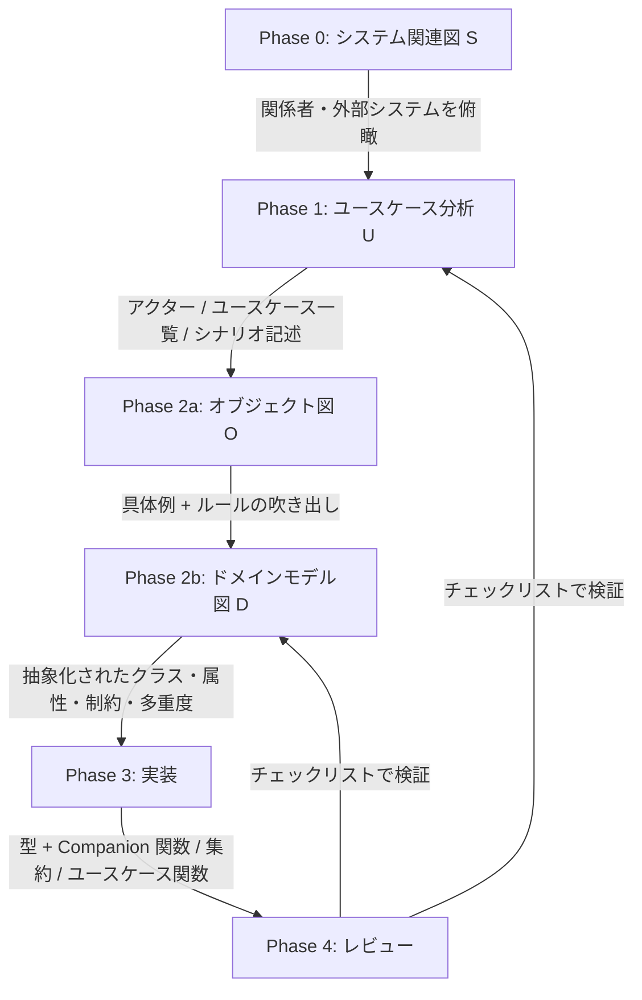

# 全体プロセス

## 狙い

DDDのモデリング手法は数が多く（イベントストーミング、ICONIX、RDRA、UMLフルセット…）、そのまま使おうとすると学習コストで挫折しやすい。この方法論は次の2つを接続し、**「分析してから実装する」までを迷わず一直線に進めること**を目的にする。

- **ユースケース分析**：松岡幸一郎さん（ログラス）のユースケース駆動アプローチ。「ユーザー起点でシステムの振る舞いを言語化し、モデリング対象のスコープを絞る」
- **ドメイン分析**：同じく松岡さんが提唱する **SUDOモデリング**（S:システム関連図 / U:ユースケース図 / D:ドメインモデル図 / O:オブジェクト図）のうち、実装に直結するD・Oを中心に使う
- **実装**：ミノ駆動さんの「業務ルールをドメインに集約する・不正な値を存在させない」原則を、kamae の関数型スタイル（Discriminated Union、Companion Object の純粋関数、Result、Branded ID、集約）で実現し、モデルをそのままコードに翻訳する

## 全体フロー

分析は一度で完成しない。**実装して初めて見つかる矛盾やモレは、ユースケース図・ドメインモデル図に必ず反映して往復する**（Phase 4 → B/D への矢印）。

## フェーズごとの入出力

| フェーズ | 目的 | インプット | アウトプット | 詳細 |
|---|---|---|---|---|
| 0. システム関連図(S) | 開発対象と関わるアクター・外部システムの全体像を把握する | 業務ヒアリング、既存システム構成 | システム関連図（誰が/何が、どのプロダクト・デバイスと繋がるか） | [02-domain-analysis.md](02-domain-analysis.md) |
| 1. ユースケース分析(U) | ユーザー起点でシステムの振る舞いを言語化し、スコープを限定する | 要求・要望、業務フロー | ユースケース図、シナリオ記述（基本/代替/例外フロー、事前条件/事後条件） | [01-usecase-analysis.md](01-usecase-analysis.md) |
| 2a. オブジェクト図(O) | 具体例でドメインの登場人物・データ・ルールを洗い出す | シナリオ記述 | 具体的なオブジェクトの例、属性値、ルール（吹き出し） | [02-domain-analysis.md](02-domain-analysis.md) |
| 2b. ドメインモデル図(D) | オブジェクト図を抽象化し、実装可能な粒度のクラス構造にする | オブジェクト図 | 簡易クラス図（属性・制約・関連・多重度・集約範囲・英語名） | [02-domain-analysis.md](02-domain-analysis.md) |
| 3. 実装 | ドメインモデル図を業務ルールが漏れないコードに翻訳する | ドメインモデル図 | 型 + Companion 関数、集約、ユースケース関数、Repository | [03-implementation-guideline.md](03-implementation-guideline.md) |
| 4. レビュー | モデルと実装の一致、設計原則の遵守を確認する | 実装、テスト | チェックリストの結果、モデルへのフィードバック | [checklist.md](checklist.md) |

## なぜ「オブジェクト図 → ドメインモデル図」の順か

人はいきなり抽象的なクラス図を書けない。先に **具体的な1〜2ケース（オブジェクト図）** で「タスクAは未完了で作成される」「セミナーBは定員5人で、すでに5件申込がある」のような**実例とルール**を書き出し、そこから共通部分を抽象化してドメインモデル図にする方が精度が上がる（松岡さんの講演・Qiita実践例で共通して報告されている進め方）。

## いつ何を作るか（省略の判断）

SUDOのすべてを毎回フルセットで作る必要はない。

- **システム関連図(S)**：複数プロダクト・複数チームにまたがる変更のときだけ作る。単一サービス内の小さな機能追加では省略してよい。
- **ユースケース図**：ストーリー一覧（チケット管理ツール）で代替できるなら図を省略し、シナリオ記述だけ残してもよい。
- **オブジェクト図(O)**：機能をまたぐ業務ルールの整合が必要なときは原則作る。ここが「同じチームにも伝わらない」問題を解消する一番効果が大きい部分。
- **ドメインモデル図(D)**：実装が可視化される仕組み（型定義そのものがドキュメントになる等）が整うまでは作り続ける。

大事なのは図の数を揃えることではなく、**「ユースケース → 具体例とルール → 抽象モデル → コード」の順に情報が欠落なく変換されること**。
