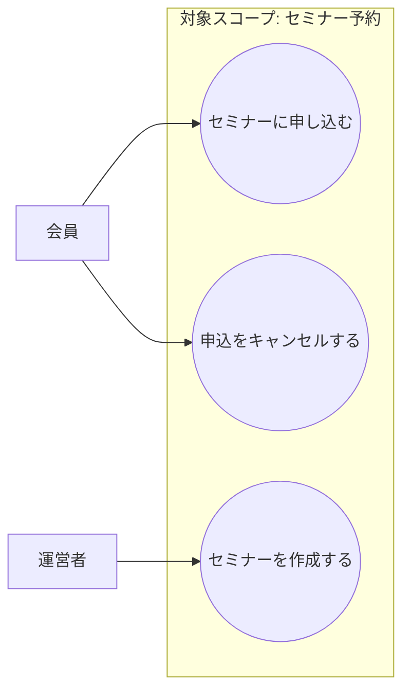

# ユースケース分析の型

出典: 松岡幸一郎さん（ログラス）の講演「ユーザーとアプリケーションの相互作用を定義する」（https://logmi.jp/tech/articles/322835）

## 目的

- 問題を**具体化・言語化**する
- 後続のドメイン分析（オブジェクト図・ドメインモデル図）の**スコープを限定する**

いきなり正確な図を書こうとしない。ホワイトボードへの殴り書きレベルから始めて構わない。

## 手順

### 1. アクターを洗い出す

「システムを使う人・モノ」を役割単位で列挙する。組織上の役職ではなく、**システムに対する振る舞いの違い**で分ける（例：「会員」と「運営者」は権限が違うので別アクター）。

### 2. ユースケースを列挙する

アクター起点で「〇〇が△△する」という**動詞+目的語**の形で列挙する。

- 良い例：「会員がセミナーに申し込む」「運営者がセミナーを公開する」
- 悪い例：「セミナー管理」「申込機能」（粒度が大きすぎてシナリオが書けない）

### 3. スコープを枠で囲む

今回のモデリング・実装で対象にするユースケースを枠（境界）で明示し、対象外（既存のまま/将来対応）を明言する。ここを曖昧にすると、ドメインモデル図の範囲がぶれる。

### 4. ユースケース図を書く

Mermaidの場合の例：



図の精度よりも「アクターとユースケースの対応漏れがないか」「スコープ外に何を置いたか」が明確であることを優先する。

### 5. シナリオ記述を書く（ここが実装への橋渡しで最重要）

ユースケースごとに以下のテンプレートで書く。**代替フロー・例外フローに業務ルールが集中する**ので、ここを丁寧に書くほどドメイン分析が楽になる。

```markdown
## UC1: 会員がセミナーに申し込む

- アクター: 会員
- 事前条件: 会員登録済み、セミナーが公開済み
- 事後条件（成功時）: 申込が「申込済」状態で作成される

### 基本フロー
1. 会員がセミナー詳細画面を開く
2. 会員が「申し込む」を押す
3. システムが定員・重複申込を確認する
4. システムが申込を作成する

### 代替フロー
- 3a. 定員に空きがない場合 → キャンセル待ちとして受け付ける（対象スコープ外: 将来対応）

### 例外フロー
- 3b. すでに同じ会員が同じセミナーに申込済みの場合 → エラーを返し、申込を作成しない
```

このシナリオ記述の「事前条件」「事後条件」「代替/例外フロー」が、次のドメイン分析フェーズで**オブジェクト図の具体例**や**ドメインモデル図の制約（吹き出し）**にそのまま変換される。

## Tips

- 完璧な図を目指さない。目的は「合意」であって「網羅」ではない。
- シナリオ記述の代替/例外フローが思いつかないユースケースは、まだ理解が浅い可能性が高い。ドメインエキスパートに質問を重ねる。
- 実装フェーズで想定外のケースが見つかったら、このシナリオ記述に追記して往復する（[00-methodology.md](00-methodology.md) のPhase 4参照）。
