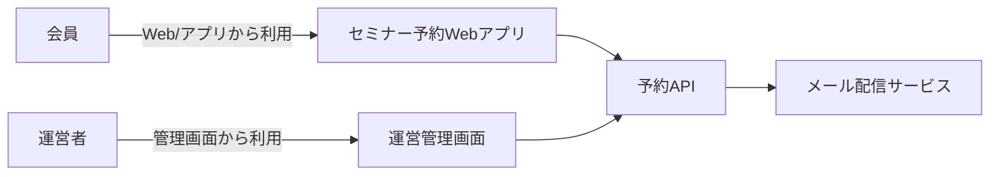
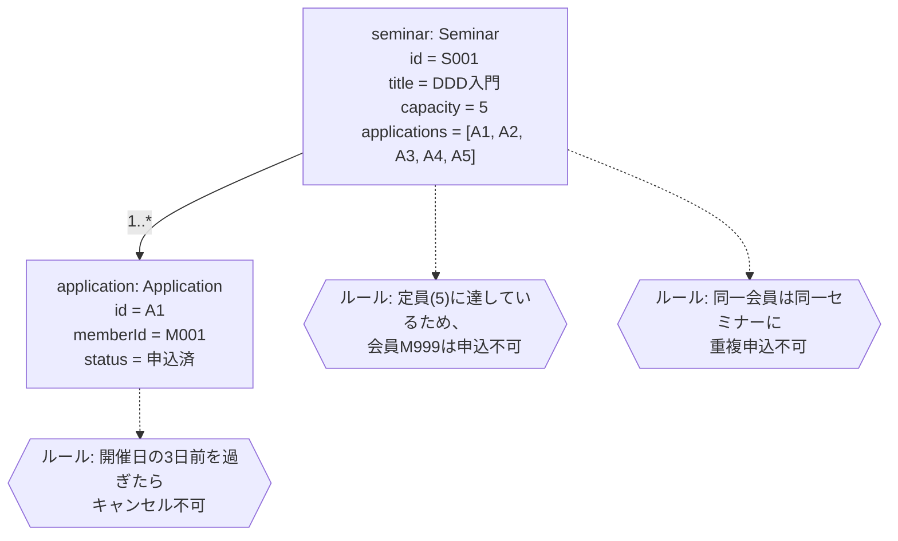
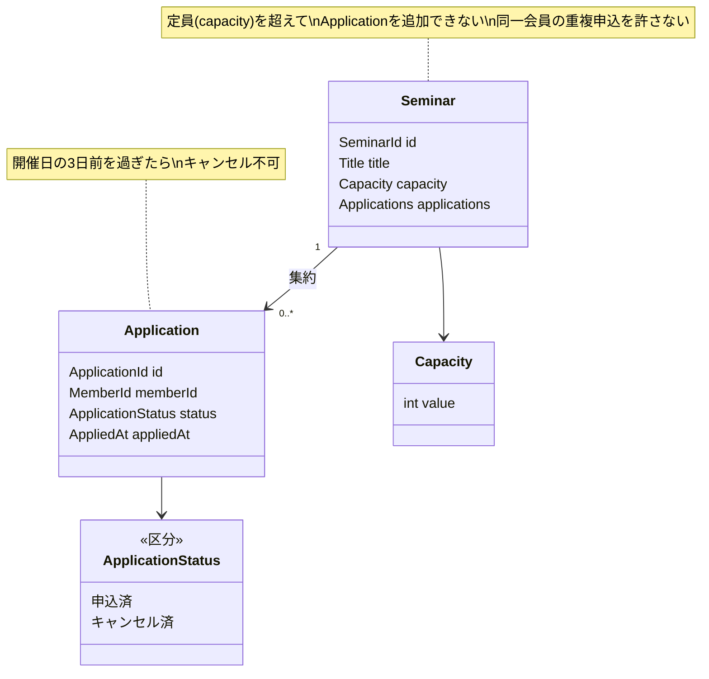

# ドメイン分析の型（SUDOモデリング）

出典: 松岡幸一郎さん（ログラス）が提唱する SUDOモデリング。DDDのモデリング手法が多すぎて選べない問題に対し、**S（システム関連図）/ U（ユースケース図）/ D（ドメインモデル図）/ O（オブジェクト図）** の4つに絞った軽量モデリング手法（参考: https://qiita.com/takuuuuuuu777/items/ab5f6854738af5f1b401 ）。

このドキュメントでは U（ユースケース図）は [01-usecase-analysis.md](01-usecase-analysis.md) で扱い済みとして、**S → O → D** の順で説明する。

## S: システム関連図

**いつ作るか**：複数プロダクト・複数チームにまたがる変更のときに作る。単一サービス内の小さな機能追加なら省略可。

**書き方**：開発対象システムと、関わるアクター・外部システム・デバイスとの関連を示す。利用者とプロダクトの接点を色分けするなどして一目でわかるようにする。

## O: オブジェクト図（具体例から始める）

**いつ作るか**：機能をまたぐ業務ルールの整合が必要なときは原則作る。効果が一番大きい工程。

**書き方**：
- ユースケースのシナリオ記述にある**事前条件・事後条件・代替/例外フロー**を、実際の値を入れた1〜2件の具体例として書き出す
- 属性は代表的なものだけでよい。メソッドは書かない
- **業務ルール・制約は吹き出しで書き出す**（ここが実装時のガード節・不変条件に直結する）
- オブジェクト同士の関連を線で示す

具体例を作ると「同じチームの開発者にも伝えきれない」「QAに伝わらない」問題が解消される。ドメインエキスパート・QAとこの図を見ながら会話するのが最も費用対効果が高い。

## D: ドメインモデル図（オブジェクト図を抽象化する）

**作成手順**：
1. オブジェクト図の具体例から共通の型・制約を抜き出す
2. 属性・制約・関連・多重度・**集約範囲**・英語名（対訳）を明確にする
3. 吹き出しのルールは「どのクラスの責務か」を決める（誰が守る不変条件か）

**集約範囲の決め方**：「同時に整合性を保たなければいけない範囲」で区切る。ここでは「定員チェック」「重複申込チェック」を`Seminar`が保証する必要があるため、`Seminar`を集約ルートとし`Application`はその内部エンティティにする。

## ドメインモデル図から実装可能な粒度へ落とすコツ（ミノ駆動さんの観点 × 関数型）

SUDOモデリングの吹き出しは「自然言語のルール」で終わりがちだが、そのままでは実装時に霧散する。次の観点でモデルの粒度を実装可能なところまで詰める。クラス図は「概念」を表すもので、実装が関数型でも矛盾しない。

- **吹き出しのルールは、必ずどこかの型の Companion 関数として名前を与える。** 例：「定員に達している場合は申込不可」→ `Seminar.isFull(seminar)` / `Seminar.apply(seminar, ...)`
- **属性に制約があるなら、プリミティブ型のまま図に残さず型として名前を与える。** 例：「capacityは1以上」→ `Capacity` を独立させ、`Capacity.create` が `Result` を返す
- **区分（状態・種別）は、区分ごとに持つ属性や許される遷移が変わるかを確認する。** 変わるなら Discriminated Union で状態ごとに型を分ける。変わらないなら単純なラベルでよい
- **多重度が `0..*` の関連で、コレクション自体にルールがある場合は、集約ルートのレコードに `readonly T[]` として持ち、操作は集約ルートの Companion 関数に限定する**

この変換規則の詳細は [03-implementation-guideline.md](03-implementation-guideline.md) にまとめる。実際の適用例は [examples/seminar-reservation/02-domain](../examples/seminar-reservation/02-domain) を参照。
