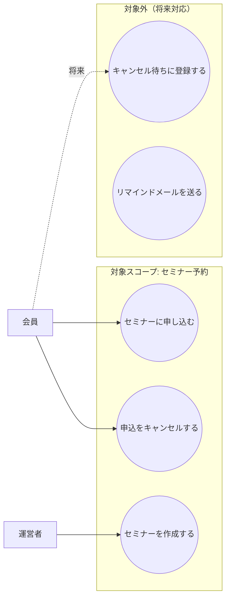

# ユースケース図（セミナー予約システム）

## アクター

- **会員**：セミナーに申し込む・キャンセルする人
- **運営者**：セミナーを企画・公開する人

## 対象スコープ

- 対象：申込・キャンセル・セミナー作成という最小のコアフロー
- 対象外：定員超過時のキャンセル待ち、通知系（今回のドメインモデルには影響するため、シナリオ記述には代替フローとして記載するが実装はしない）
