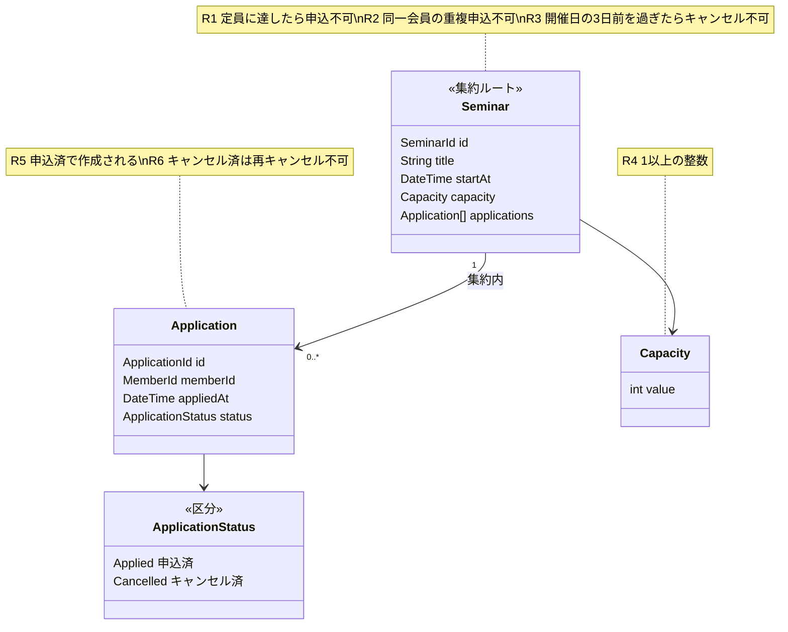

# ドメインモデル図（D）— オブジェクト図を抽象化する

[object-diagram.md](object-diagram.md) の具体例とルール R1〜R6 を抽象化し、責務を割り当てる。クラス図は「概念」を表すもので、実装が関数型（Discriminated Union + 純粋関数）でも矛盾しない。

## 集約範囲

`Seminar` を集約ルート、`Application` を内部エンティティとする。R1（定員）と R2（重複）は Application の集合全体を見ないと判定できず、同時に整合させる必要があるため。R3 は開催日時（Seminar の属性）を要するため、キャンセル操作も Seminar 経由で行う。

## 責務の割り当て

| ルール | 責務を持つ要素 |
|---|---|
| R1, R2 | Seminar（申込の追加） |
| R3 | Seminar（申込のキャンセル） |
| R4 | Capacity（生成時の検証） |
| R5, R6 | Application（状態遷移: Applied → Cancelled の一方向） |

## 対訳

| 日本語 | 英語 |
|---|---|
| セミナー | Seminar |
| 申込 | Application |
| 定員 | Capacity |
| 申込済 / キャンセル済 | Applied / Cancelled |
| 会員 | Member |
