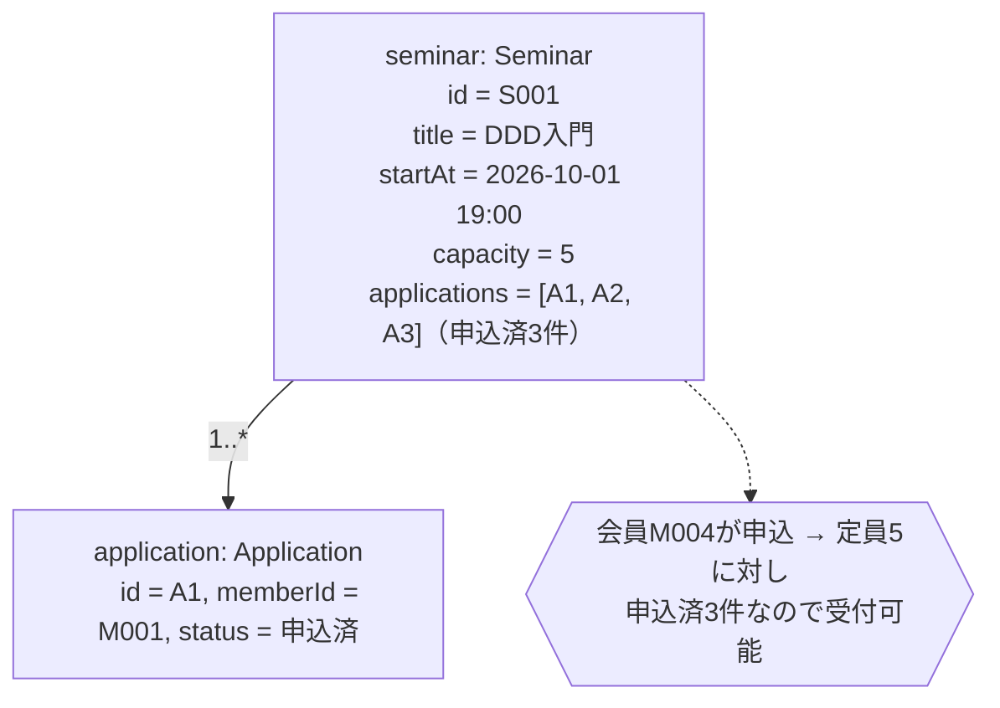
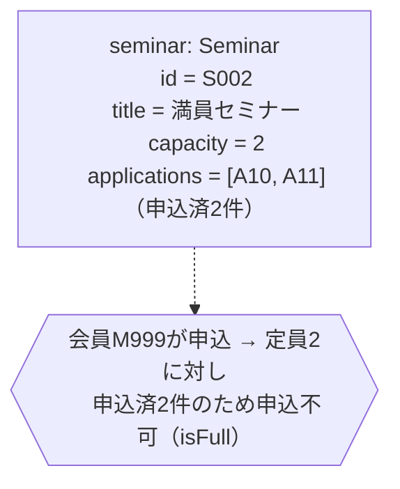
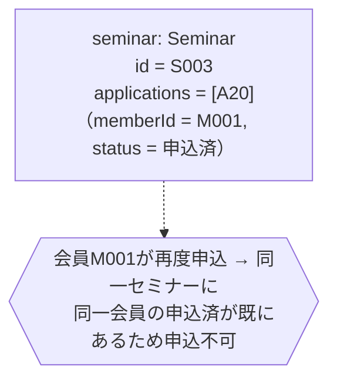
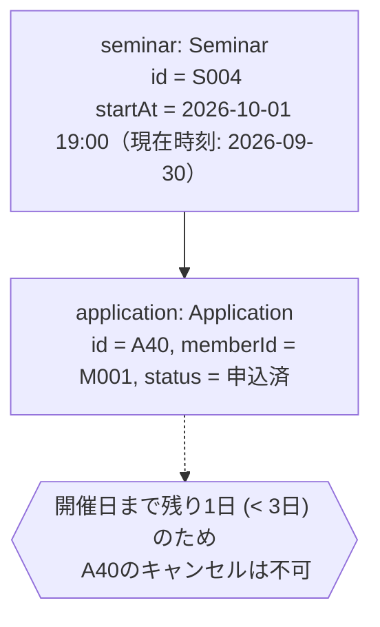
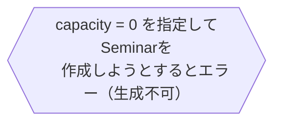

# オブジェクト図（O）— 具体例から始める

[01-usecase/scenarios.md](../01-usecase/scenarios.md) の事前条件・事後条件・代替/例外フローを、実際の値で書き出す。

## ケース1: 定員に空きがあるセミナーへの申込（UC1 基本フロー）

## ケース2: 定員に達しているセミナーへの申込（UC1 代替フロー 3a）

## ケース3: 重複申込（UC1 例外フロー 3b）

## ケース4: 開催直前のキャンセル（UC2 例外フロー 3a）

## ケース5: 定員0以下のセミナー作成（UC3 例外フロー 2a）

## ここまでで洗い出せたルール一覧

1. 定員(capacity)に達している場合、そのセミナーへの新規申込は不可（`Seminar`の責務）
2. 同一会員は同一セミナーに重複して申込済状態になれない（`Seminar`の責務）
3. 開催日の3日前を過ぎたら、その申込はキャンセル不可（`Application`の責務、`Seminar`の開催日時が必要）
4. 定員(capacity)は1以上でなければならない（`Capacity`値オブジェクトの責務）
5. 申込は必ず「申込済」状態で作成される（`Application`の生成規則）
6. キャンセル済の申込を再度キャンセルすることはできない（`Application`の責務）

これらを [domain-model-diagram.md](domain-model-diagram.md) で抽象化し、責務を割り当てる。
