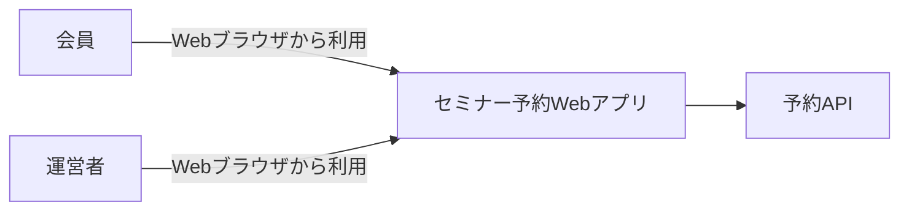

# システム関連図（S）

セミナー予約Webアプリ単体の変更であり、他プロダクトとの連携もないため、本来は省略可能な規模。参考としてSUDOモデリングの型どおりに一応作成する。

```mermaid
flowchart LR
    Member[会員] -->|Webブラウザから利用| WebApp[セミナー予約Webアプリ]
    Organizer[運営者] -->|Webブラウザから利用| WebApp
    WebApp --> API[予約API]
```
